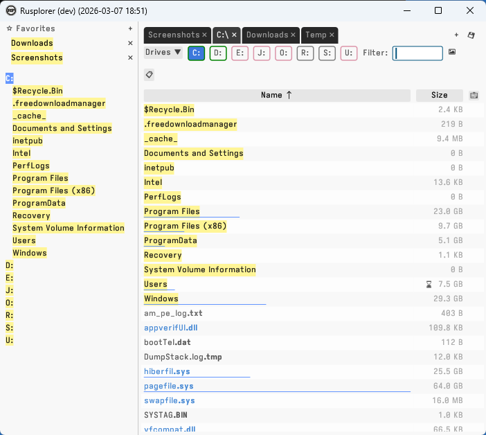

# Rusplorer 🚀

A lightweight, blazingly-fast file explorer written in Rust / egui for Windows.

<div align="center">


</div>

## Disclaimer

The primary goal was to specifically fit my own vision of a file explorer. That's why there are next to no options or configuration. Consequently, you may like it too, or you may not.  

**It is not intended to be pretty, but fast as hell, minimalist, and practical.** Everything must be pretty first these days, but I couldn't care less about Rusplorer being pretty. It must WORK and be PRACTICAL, ROBUST and QUICK.


<div align="center">

<br>



</div>

## ⚡ Key Advantages

### Speed & Performance
- **Super lightweight** - 9 MB self contained executable (includes UI framework, font, logo, compatibility renderer for old GPUs, etc.)
- **All folders and file sizes** - Computed lazily and multithreaded, 0 impact on speed and reactivity. Plus, pauses folder size calculation on focus loss
- **Instant directory listing** - Displays folder contents immediately without waiting for file size calculations
- **Background threading** - No UI blocking, ever smooth interaction
- **Minimal overhead** - Built with `egui` and `eframe` for efficient rendering

### Engineer-Friendly Design
- **Functionality first** - No bloat, no fancy animations, just pure functionality
- **Lightweight GUI** - Single executable, instant startup
- **Multi-drive support** - Easy drive switching with visible drive selector
- **Possibility to save state as .rsess files**

### User Experience
- **No installation (portable)** - Just run rusplorer.exe; config.json file will be created on the side as you go
- **Tabs support**
- **Side mouse button support** - Use your mouse back/forward buttons for navigation
- **2.5 column layout** - File names on the left, sizes aligned to the right, with optional modification date column
- **Interactive breadcrumb**

## 🚀 How to run the program

No installation needed.  
There's a single executable in the root folder. Just launch rusplorer.exe, that's it.


## 📋 Features

- ✅ Fast directory browsing
- ✅ View all folders and file sizes (lazy-loaded)
- ✅ Support all kinds of drives (SSD/HDD/USB/Network) with color indications
- ✅ Back/forward navigation with history
- ✅ Mouse button 4/5 support (side buttons)
- ✅ Keyboard navigation (Alt+arrows)
- ✅ Folder/file differentiation with colors
- ✅ 2.5-column layout (names + sizes + optional date)
- ✅ GUI application, no terminal window

## 🛠️ Technical Stack

- **Language**: Rust
- **GUI Framework**: egui + eframe
- **Toolchain**: x86_64-pc-windows-gnu (MinGW)
- **Binary Size**: Compact standalone executable

## Optional (for developers): how to build the app


I use a handy build script that:
1. Kills any running Rusplorer instance
2. Rebuilds the project
3. Launches the app

```powershell
./source_code/build.ps1
```

Or manually:
```powershell
cargo build --release
```
